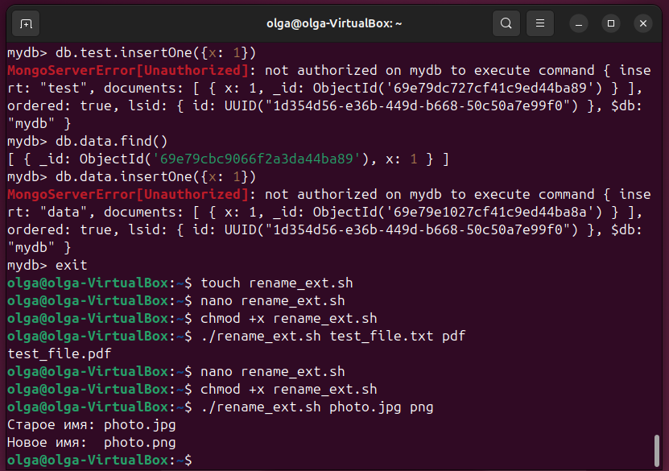
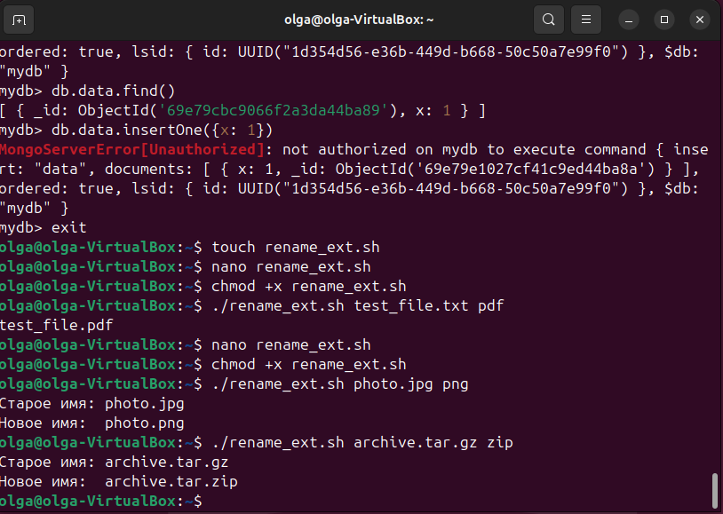
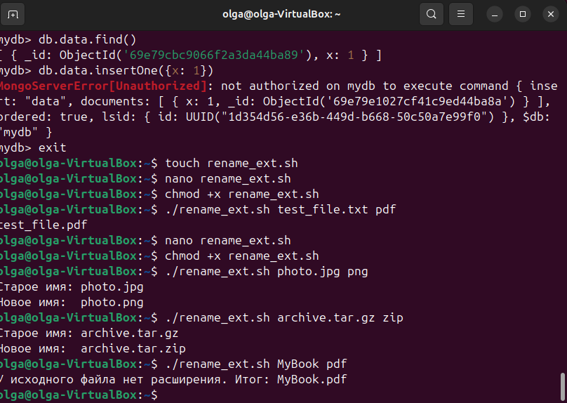

# отчет по выполнению заданий MongoDB
## Задание 1: Задание 1 – установить MongoDB. - Cоздать таблицу data -  создать пользователя manager, у которого будет доступ только на чтение этой таблицы.

## Задание 2: ознакомиться с нижеуказанной статьей по теме «Bash»

## Задание 3: написать Bash-скрипт в соответствии с требованиями: Содержание скрипта: замена существующего расширения в имени файла на заданное. Исходное имя файла и новое расширение передаются скрипту в качестве параметров. Основное средство: нестандартное раскрытие переменных. Усложнение: предусмотреть штатную реакцию на отсутствие расширения в исходном имени файла.

## Задание 4: написать Bash-скрипт в соответствии с требованиями: Содержание скрипта: выделение из исходной строки подстроки с границами, заданными порядковыми номерами символов в исходной строке. Усложнение: предусмотреть возможность не выделения, а удаления подстроки.Основные средства: команда cut, переменные оболочки

