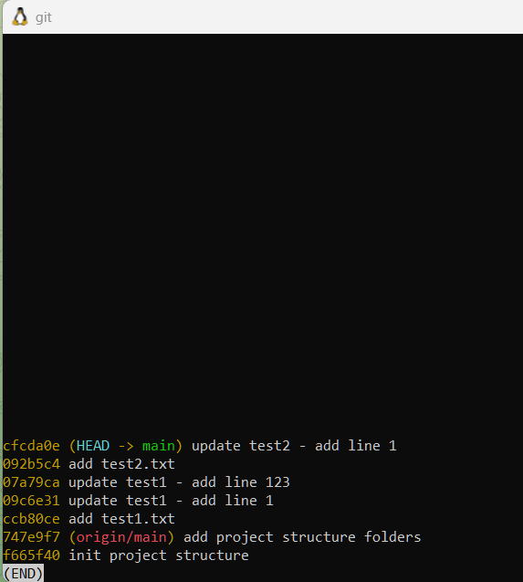
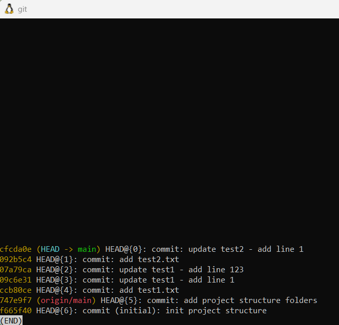
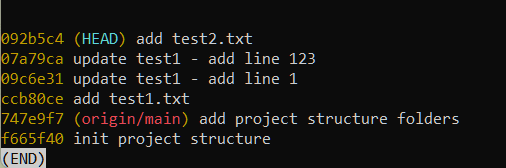
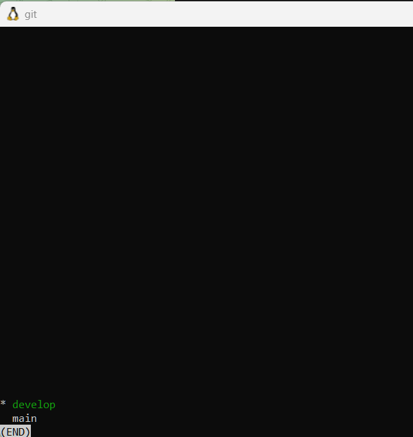
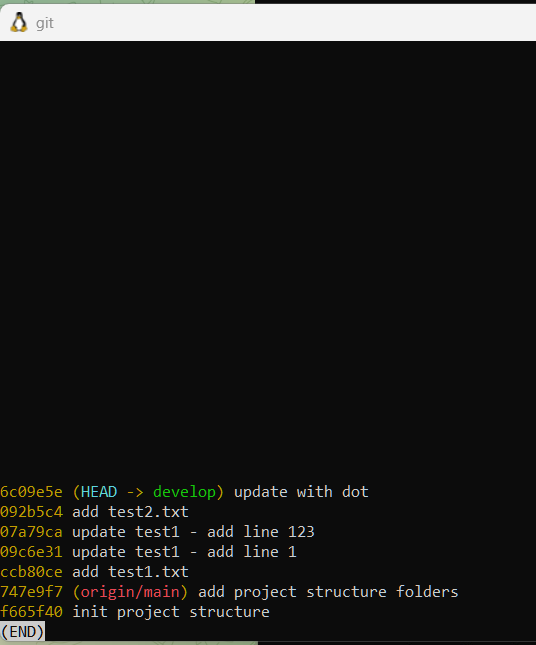
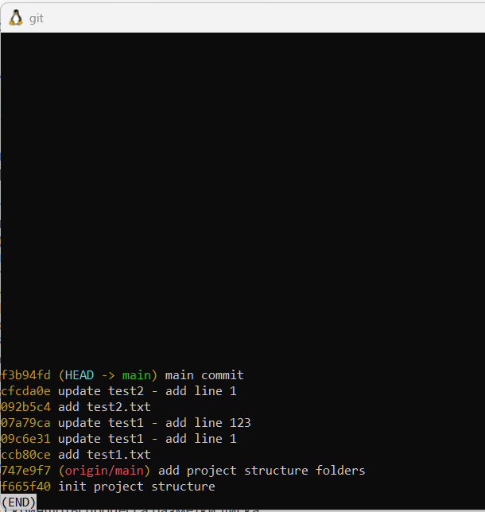
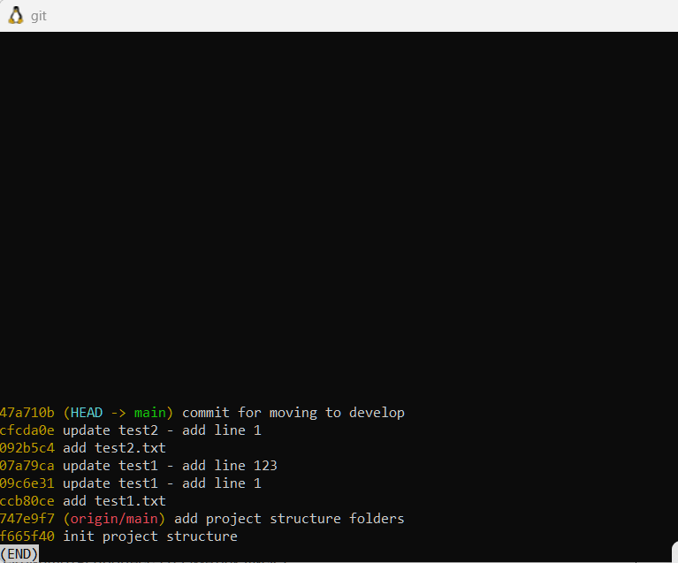
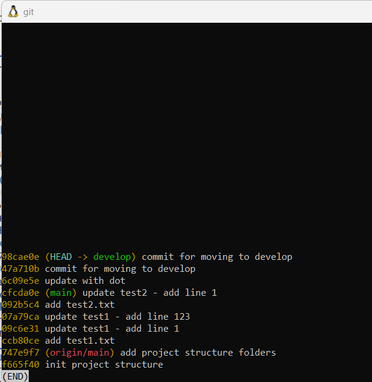
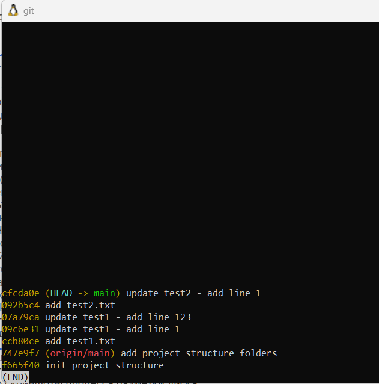
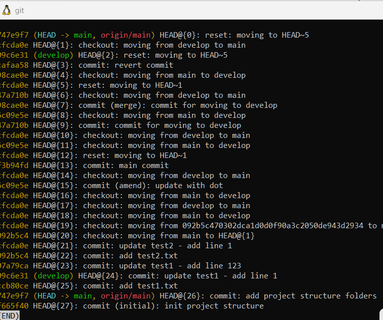

# отчет по выполнению заданий Git
## Задание 1: 5 коммитов (скрин)

## Задание 2: reflog (скрин)

## Задание 3: ветка develop

## Задание 4: ammend

## Задание 5: main comit

## Задание 6: reset

## Задание 7_9

# отчет по выполнению заданий VM
## Задание 1: процесс разметки диска (скрин)

